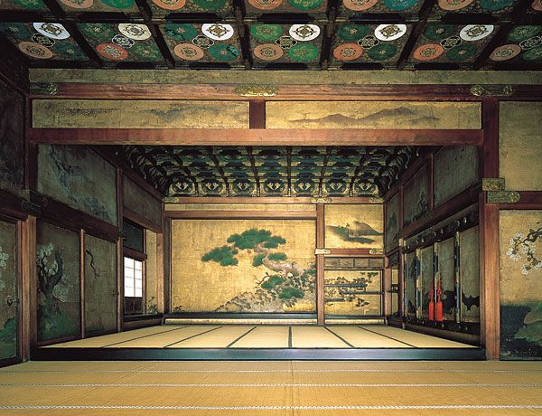

# 🧠 Concept 02: How JavaScript Works?

The time has come to **understand how JavaScript works** behind the scroll.

> “To master the sword, you must first master the stance.  
> To wield JavaScript, you must first see the world it sees.”

---

## Episode 01

A person travels across many lands, searching for a wise monk who knows the secrets of **JavaScript**. After a long journey, they arrive at the foot of a great mountain, where the monk lives in a temple at the top.

But before they can climb the stairs to the temple, the person must first enter **a hidden chamber**. This chamber is where all the secrets of JavaScript’s power are prepared. Only after understanding this chamber can they truly meet the monk and learn the full wisdom.

This is the **Execution Chamber**.


Here, every line of code is understood, remembered, and performed. JavaScript prepares everything in this chamber before it begins its work.

And in this chamber, **the ritual is called:**

> The Execution Context 🧠

---

## The Execution Context – Where Code Comes Alive

The **Execution Context** is like a ritual that happens before the code runs:

1. 🪔 **Creation Phase** – JavaScript sets up everything.
2. ⚔️ **Execution Phase** – JavaScript runs the code line by line.

---

### 🔮 What Happens in the Creation Phase?

Before anything runs, JavaScript quietly prepares. It does three things:

1. **Creates the Global Object** (like `window` in browsers).
2. **Creates a 'this' keyword** and binds it.
3. **Hoists** all variables and functions (moves them to the top).

> Yes, before running the code, JavaScript prepares everything quietly in the background.

---

### 🔥 Then Comes the Execution Phase

This is when JavaScript starts **running the code** step by step.

If a function is called, a new mini **Execution Context** is created inside the main one — like a smaller chamber inside the larger one.

---

## The Stack of Scrolls – Call Stack

Imagine the dojo has a **stack of scrolls**.

Each time a function is called, a new scroll is added to the top. When it finishes, the scroll is removed.

This is called the **Call Stack**.

```javascript
function meditate() {
  console.log("Breathe in...");
}

meditate();
```

- JavaScript creates a scroll for `meditate()`.
- Reads it.
- Finishes it.
- Removes it.

It’s always **last in, first out**.

---

## Hoisting – The Art of Preperception

JavaScript is wise. Before running the code, it **scans the whole scroll** first.

Even if a variable or function is written later in the code, JavaScript **knows** it’s there.

```javascript
sayHi();
function sayHi() {
  console.log("Hi Master!");
}
```

This works — because the **function is hoisted** to the top.

But be careful:

```javascript
console.log(x); // undefined
var x = 10;
```

- `x` is hoisted, but not its value.
- Only the **declaration** is hoisted.

---

## Memory, Variable Environments & Lexical Scope

Each scroll remembers its own variables.

Nested scrolls (like functions inside functions) can **access the memory** of the scroll outside it.

This is called **Lexical Scope**.

```javascript
function temple() {
  let monk = "Shaolin";
  function chant() {
    console.log(monk); // Accesses parent’s memory
  }
  chant();
}
temple();
```

---

## ⚔️ Hidden Ability Unlocked: **Mind Sight**

*Episode Technique: See How JavaScript Reads Your Code*

You now understand:

- The two phases of execution
- How memory is prepared before execution
- How the call stack works
- What hoisting really means
- Why scope matters

> Mastery is not writing code.  
> Mastery is seeing code **before it runs.**

---

## 🛠️ Path of Action: Practice Begins

1. Revisit old code.
2. Predict how JavaScript will prepare and execute it.
3. Draw the execution flow and call stack.
4. Visualize scopes and what gets hoisted.

O

Write functions. Nest them. Call them.

Trace the scroll stack in your mind.

---

## 📜 Final Scroll: Gwen’s Whisper

> “Before the warrior strikes, the warrior sees.  
> You now see the flow.  
> Next, you learn to **move with it**.”

---

## 🔥 Next Episode Tease:  
## EPISODE 02 – The Person arrives the Monk!

----  
|| Hare Krishna ||
